# ⚡ EV Charging Station Utilization Dashboard

---

## 📌 Project Summary

This dashboard helps urban planners and EV companies track and optimize **charging station performance**.  
It uses Python and Power BI to identify **utilization gaps**, **peak demand zones**, and **idle/overloaded locations** to drive smarter deployment decisions.

---

## 🎯 Business Problem

EV infrastructure expansion often faces inefficiency due to:

- Underutilized or overloaded stations  
- Uneven demand across geographies  
- Lack of real-time usage monitoring

This project aims to solve this by providing insights into **location-level utilization trends**, enabling optimized rollout strategies.

---

## 🔍 Key Features

- 🗺️ Location-wise utilization analysis  
- 🔋 Peak hour and idle station detection  
- 📍 Demand clustering by city/region  
- ⚡ Overload flagging for maintenance planning  
- 📈 Deployment recommendations for new zones

---

## 🛠 Tech Stack

- **Language:** Python  
- **Libraries:** `pandas`, `geopandas`, `datetime`  
- **Data:** CSV + geo-tagged station logs  
- **Visualization:** Power BI  
- **File Format:** `.pbix`

---

## 🧠 Architecture

```mermaid
flowchart TD
    subgraph KPIs
        KPI1["Station Utilization %"]
        KPI2["Peak Hours by City"]
        KPI3["Location-Wise Demand"]
        KPI4["Overloaded Stations"]
        KPI5["Idle Stations Detected"]
    end

    SRC["📥 EV Station Log Data (Geo CSV)"] --> PY["🐍 Python Script"]
    PY --> PD["🧹 Pandas + Geo Cleanup"]
    PD --> DB["📊 Excel Table / DB"]
    DB --> BI["📈 Power BI Dashboard"]
    BI --> OUT["💡 Deployment & Efficiency Insights"]
    BI --> KPI1 & KPI2 & KPI3 & KPI4 & KPI5

```

## 📊 KPIs Tracked
Charging Station Utilization %

Peak Demand Hours per Region

Geographic Demand Concentration

Overloaded vs Idle Stations

Deployment Suggestions

## 📸 Dashboard Preview

## 🚧 Challenges & Learnings
Cleaning inconsistent geo-coordinates

Mapping idle stations and clustering usage

Visualizing overloads using conditional formatting

Enhancing user experience via tooltip filters

## 🚀 Future Enhancements
Add live integration from IoT station APIs

Build alert system for idle/overload zones

Deploy as web app with live map interactivity

Integrate cost efficiency analytics by zone

## 👨‍💻 About Me
Hi, I'm B. Sunil Kumar Reddy, a Data Analyst who builds real-world dashboards from real-world data.
Focused on APIs, automation, and business value through analytics.

🔗 LinkedIn Profile(https://www.linkedin.com/in/sunilreddy-data-analyst/)

💻 Explore More Projects(https://github.com/Sunil5411)

## ⭐ Support
If you found this project helpful, feel free to give it a ⭐ — it motivates me to keep building and sharing more real-world analytics projects.
